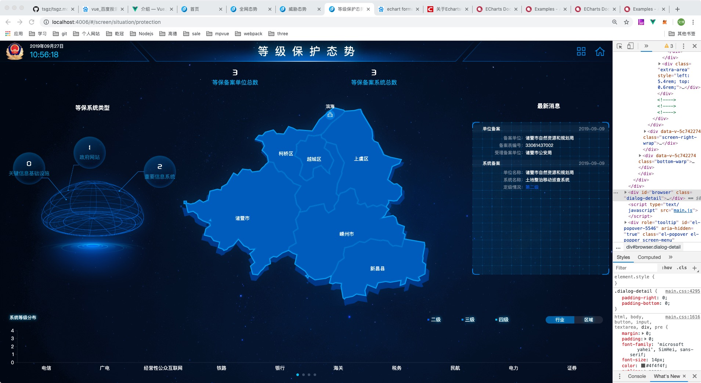

## 态势感知界面的样式分析 目录

#### 布局

 1. rem

 2. flex

#### 动画

 1. 平移

 2. 轮动

 3. vue动画

#### 图表

 1. 折线图

 2. 柱状图

 3. 地图

## 布局

### 1.rem

#### 概念

rem是CSS3新增的相对长度单位，是指相对于根元素html的font-size计算值的大小。如果想要设置12px的字体大小也就是12px/16px = 0.75rem。

#### 作用

由于px是相对固定单位，字号大写直接被定死，无法随着浏览器进行缩放。

em和rem都是相对单位，em是相对于其父元素的font-size，页面层级越深，em换算越复杂，麻烦。

rem直接相对于根元素html，避开层级关系，移动端新型浏览器对其支持较好。

#### 写法

1rem = 20px;

```
html{
  font-size: 20px; 
}
```

#### 那如何根据窗口大小，自动缩小和变大？

举个板栗：

1、我给页面设置的根字体为20px，假定设计图给我的640尺寸，那我应该怎么一个计算方式。
 
20 * document.documentElement.clientWidth /（640）= 当前页面根字体大小px。
 
2、我给页面设置的根字体为20px，假定设计图给我的750尺寸，那我应该怎么一个计算方式。

20 * document.documentElement.clientWidth /（750）= 当前页面根字体大小px。

#### 项目中的例子

```
    //extend.js
    function setFont() {
        let baseWidth = 1920;
        let width = $(window).width();

        let prefix = width / baseWidth;
        $('html').css({'font-size': 625 * prefix + '%'});
    }

    setFont();

    $(window).on('resize', () => {
        setFont();
    });
```

1rem = ?px;


### 2.flex

#### 兼容性

ie10+

#### 用法

任何一个容器都可以指定为 Flex 布局。

```
.box{
  display: flex;
}
```

注意，设为 Flex 布局以后，子元素的float、clear和vertical-align属性将失效。

#### 基本概念

采用 Flex 布局的元素，称为 Flex 容器（flex container），简称"容器"。它的所有子元素自动成为容器成员，称为 Flex 项目（flex item），简称"项目"。

#### 容器的常见属性

a.flex-direction（属性决定主轴的方向）

```
.box {
  flex-direction: row | row-reverse | column | column-reverse;
}
```

b.flex-wrap

默认情况下，项目都排在一条线（又称"轴线"）上。flex-wrap属性定义，如果一条轴线排不下，如何换行。

```
.box{
  flex-wrap: nowrap | wrap | wrap-reverse;
}
```
第一个是不换行， 第二个是换行， 第三个不换行的情况下，第一行放在最下面。

c.flex-flow

flex-flow属性是flex-direction属性和flex-wrap属性的简写形式，默认值为row nowrap。

c.justify-content

justify-content属性定义了项目在主轴上的对齐方式。

```
.box {
  justify-content: flex-start | flex-end | center | space-between | space-around;
}
```

e.align-items

align-items属性定义项目在交叉轴上如何对齐。

```
.box {
  align-items: flex-start | flex-end | center | baseline | stretch;
}
```


f.align-content

align-content属性定义了多根轴线的对齐方式。如果项目只有一根轴线，该属性不起作用。

```
.box {
  align-content: flex-start | flex-end | center | space-between | space-around | stretch;
}
```


#### 项目常见属性

a.order

属性定义项目的排列顺序。数值越小，排列越靠前，默认为0。

```
.item {
  order: <integer>;
}
```

b.flex-grow

flex-grow属性定义项目的放大比例，默认为0，即如果存在剩余空间，也不放大。

c.flex-shrink

flex-shrink属性定义了项目的缩小比例，默认为1，即如果空间不足，该项目将缩小。

如果所有项目的flex-shrink属性都为1，当空间不足时，都将等比例缩小。如果一个项目的flex-shrink属性为0，其他项目都为1，则空间不足时，前者不缩小。

d.flex-basis

flex-basis属性定义了在分配多余空间之前，项目占据的主轴空间（main size）。浏览器根据这个属性，计算主轴是否有多余空间。它的默认值为auto，即项目的本来大小。

它可以设为跟width或height属性一样的值（比如350px），则项目将占据固定空间。

```
.item {
  flex-basis: <length> | auto; /* default auto */
}
```

e.flex

flex属性是flex-grow, flex-shrink 和 flex-basis 的简写，默认值为0 1 auto。后两个属性可选。

f.align-self

align-self属性允许单个项目有与其他项目不一样的对齐方式，可覆盖align-items属性。默认值为auto，表示继承父元素的align-items属性，如果没有父元素，则等同于stretch。

问题1：如何实现一个水平垂直居中的样式。

问题2：如何实现三栏布局，左右两边固定，中间宽度自适应。

## 动画

### 1.平移

#### animation

```
div{
 animation: myfirst 5s;
 -moz-animation: myfirst 5s;	/* Firefox */
 -webkit-animation: myfirst 5s;	/* Safari 和 Chrome */
 -o-animation: myfirst 5s;	/* Opera */
}

@keyframes myfirst {
 from {background:red;}
 to {background:yellow;}
}

@-moz-keyframes myfirst /* Firefox */ {
 from {background:red;}
 to {background:yellow;}
}

@-webkit-keyframes myfirst /* Safari and Chrome */ {
 from {background:red;}
 to {background:yellow;}
}

@-o-keyframes myfirst /* Opera */ {
 from {background:red;}
 to {background:yellow;}
}
```

除了from to 还可以用 
0%   {background: red;}
25%  {background: yellow;}
50%  {background: blue;}
100% {background: green;}

第三个参数
linear	动画从头到尾的速度是相同的。	
ease	默认。动画以低速开始，然后加快，在结束前变慢。	
ease-in	动画以低速开始。	
ease-out	动画以低速结束。	
ease-in-out	动画以低速开始和结束。	

这个参数可以用来做抛物线

```
<!DOCTYPE html>
<html>
<head>
<style> 

.holder {
	position: relative;
    width:300px;
	height:300px;
}
.a{
	left : 0;
	position:absolute;
	animation:mymoveY 5s;
}
.b
{
	width:100px;
	height:100px;
	background:red;
	position:absolute;
	animation:mymoveX 5s ease-in-out;
}

@keyframes mymoveX
{
	from {left:0px;}
	to {left:200px;}
}

@keyframes mymoveY
{
	0% {top:0px;}
	50% {top:200px;}
    100% {top:0px;}
}

</style>
</head>
<body>

<div class='holder'>
	<div class='a'>
		<div class='b'></div>
	</div>
</div>

</body>
</html>
```

其他参数

animation-delay			规定动画何时开始。默认是 0
animation-iteration-count	规定动画被播放的次数。默认是 1 （infinite 为无限循环）
animation-direction		规定动画是否在下一周期逆向地播放。默认是 "normal"
animation-play-state		规定动画是否正在运行或暂停。默认是 "running"
animation-fill-mode		规定对象动画时间之外的状态。

### 2.轮动

#### transition(过渡)

transition	简写属性，用于在一个属性中设置四个过渡属性。	
transition-property	规定应用过渡的 CSS 属性的名称。	
transition-duration	定义过渡效果花费的时间。默认是 0。	
transition-timing-function	规定过渡效果的时间曲线。默认是 "ease"。	
transition-delay	规定过渡效果何时开始。默认是 0。	

### 3.vue过渡


## 图表


